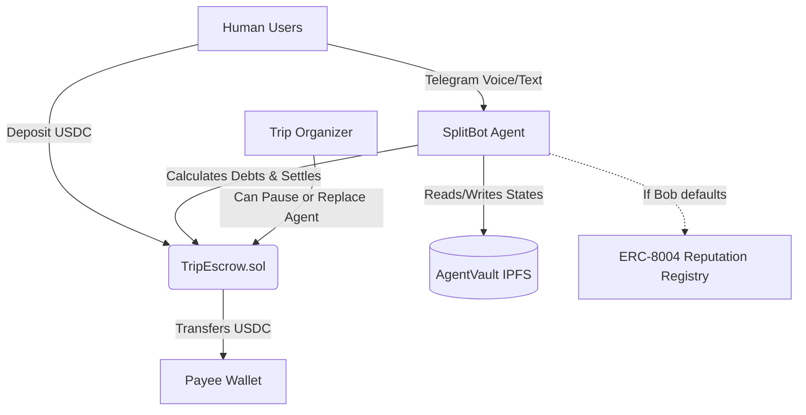

# Celo Hackathon: AgentVault + SplitBot

This project combines a foundational **Infrastructure** layer with a practical **Application** layer for the Celo "Build Agents for the Real World" Hackathon.

## 🚀 Project Overview

1.  **AgentVault (Infrastructure)**: A persistent memory service for AI agents. It uses IPFS for storage, Lit Protocol for encrypted access control, and Thirdweb x402 for micropayment barriers.
2.  **SplitBot (Application)**: A Telegram AI agent that helps groups manage trip expenses using Gemini AI for natural language parsing and debt settlement.

---

## 🏗️ System Architecture



---

## 📜 Smart Contracts

The project uses the `TripEscrow.sol` contract to manage group funds on-chain.

| Contract | Network | Address |
| :--- | :--- | :--- |
| **TripEscrow** | Celo Sepolia | `0xF768A55F53e366b20819657dE10Da4D7Fb977aB8` |
| **USDC (Testnet)** | Celo Sepolia | `0x01C5C0122039549AD1493B8220cABEdD739BC44E` |

### Key Features of TripEscrow:
- **Group Deposits**: Members lock USDC into a shared pool.
- **AI-Driven Settlement**: The Agent (SplitBot) acts as an off-chain oracle to distribute funds safely.
- **Anti-Drain Protection**: Daily caps on how much the Agent can withdraw to minimize risk if a private key is compromised.
- **Organizer Override**: Human owners can pause the contract or replace the agent at any time.

---

## 🛠️ Tech Stack

- **L2**: [Celo Sepolia](https://celoscan.io/)
- **Storage**: [IPFS via Pinata](https://www.pinata.cloud/)
- **Encryption**: [Lit Protocol](https://litprotocol.com/)
- **Payments**: [Thirdweb x402 SDK](https://thirdweb.com/)
- **AI Engine**: [Google Gemini 1.5 Flash](https://aistudio.google.com/)
- **Wallet Auth**: [Thirdweb Account Abstraction](https://thirdweb.com/account-abstraction)

---

## 📖 Deployment Details

- **Deployer Wallet**: `0xaAf16AD8a1258A98ed77A5129dc6A8813924Ad3C`
- **Agent Wallet**: Same as deployer (for the hackathon prototype)
- **Deployment Script**: `packages/contracts/script/Deploy.s.sol`

### How to Deploy (Foundry)
```bash
# Load env vars
source .env

# Deploy to Celo Sepolia
forge script script/Deploy.s.sol:Deploy --rpc-url celo-sepolia --broadcast --verify
```

---

## 🤖 Running the Agent

The SplitBot agent is located in `apps/splitbot-agent`.

```bash
cd apps/splitbot-agent
npm install
npm run dev
```

It uses **Gemini 1.5 Flash** to extract expenses from chat messages like:
- *"I paid 150 for dinner"*
- *"Bob owes me 20 for the taxi"*
- *"/settle"* (to calculate all debts and generate MiniPay links)
